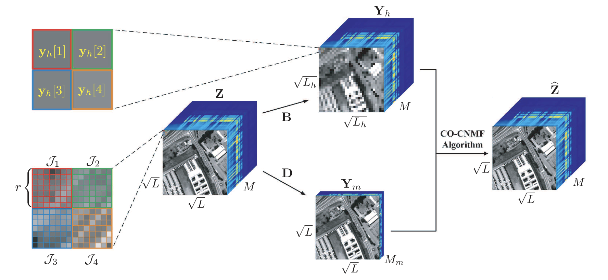

## Content
- [Project Description](#project-description)
- [CO-CNMF algorithm framework](#CO-CNMF-algorithm-framework)
- [Prepare the data](#prepare-the-data)
- [Run the code](#run-the-code)
- [Reference](#reference)
## Project Description
Data fusion is an important technique to extract useful imformation from different dataset, and to fuse the extracted information to obtain a more practically valueable dataset.

## CO-CNMF algorithm framework
CO-CNMF framework as follows:


## Prepare the data
- Ym: the multispectral data
- Yh: the hyperspectral data

## Run the code
```shell
python3 main.py
```

## Reference
C. -H. Lin, F. Ma, C. -Y. Chi and C. -H. Hsieh, "A Convex Optimization-Based Coupled Nonnegative Matrix Factorization Algorithm for Hyperspectral and Multispectral Data Fusion," in IEEE Transactions on Geoscience and Remote Sensing, vol. 56, no. 3, pp. 1652-1667, March 2018, doi: 10.1109/TGRS.2017.2766080.[(Link)](https://ieeexplore.ieee.org/abstract/document/8107710)